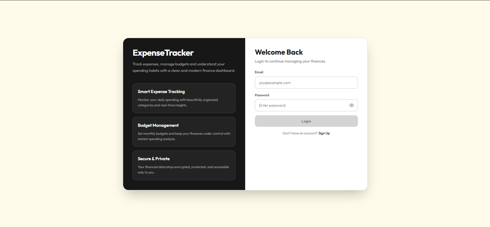
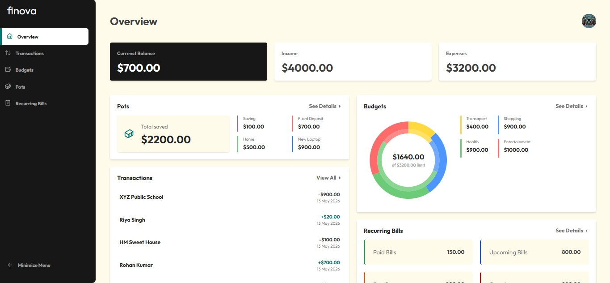
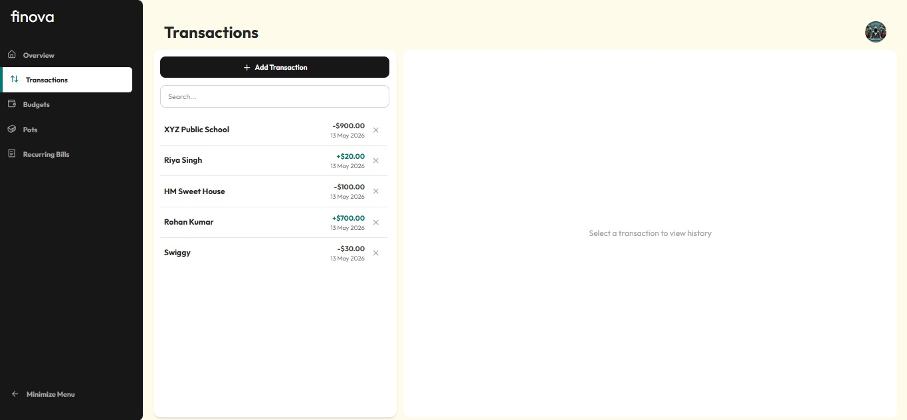
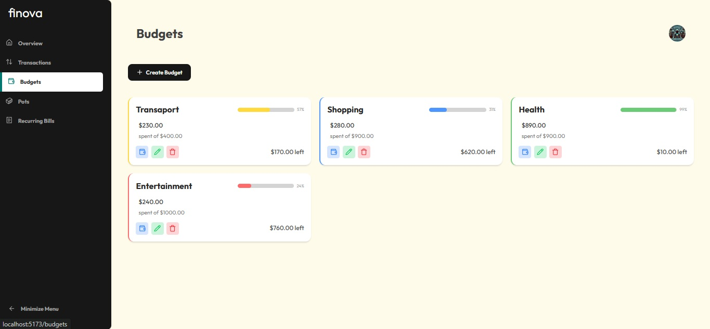
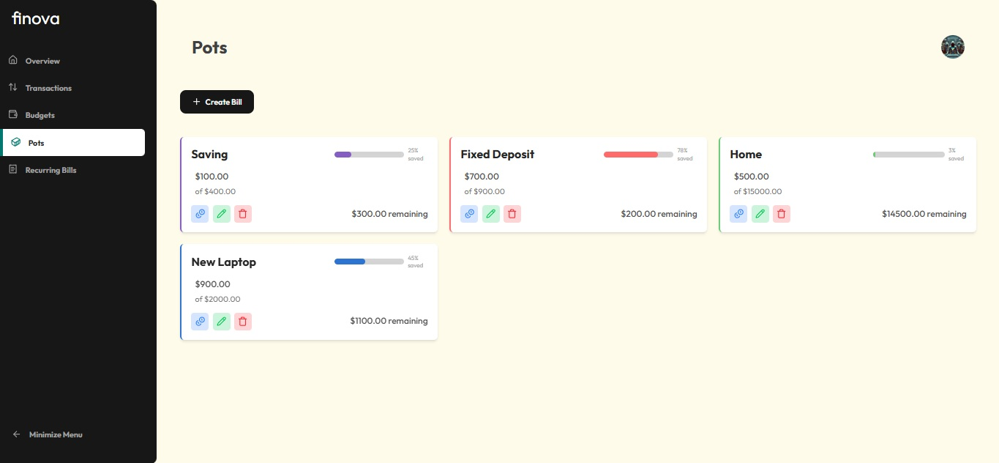
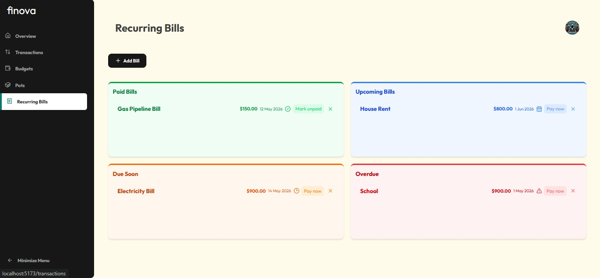
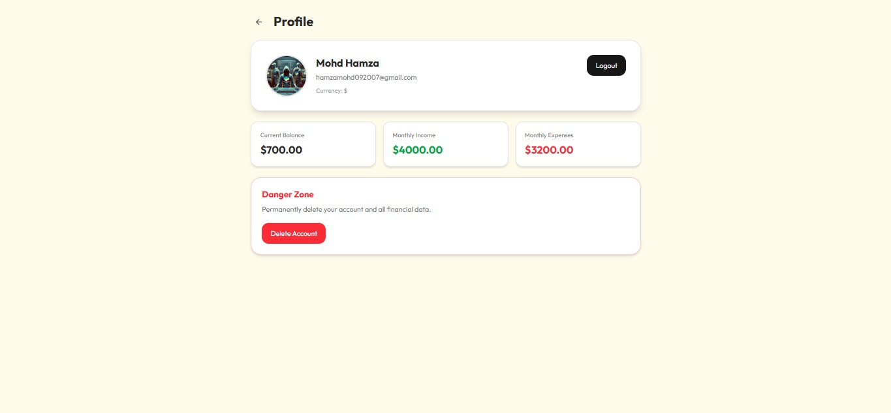
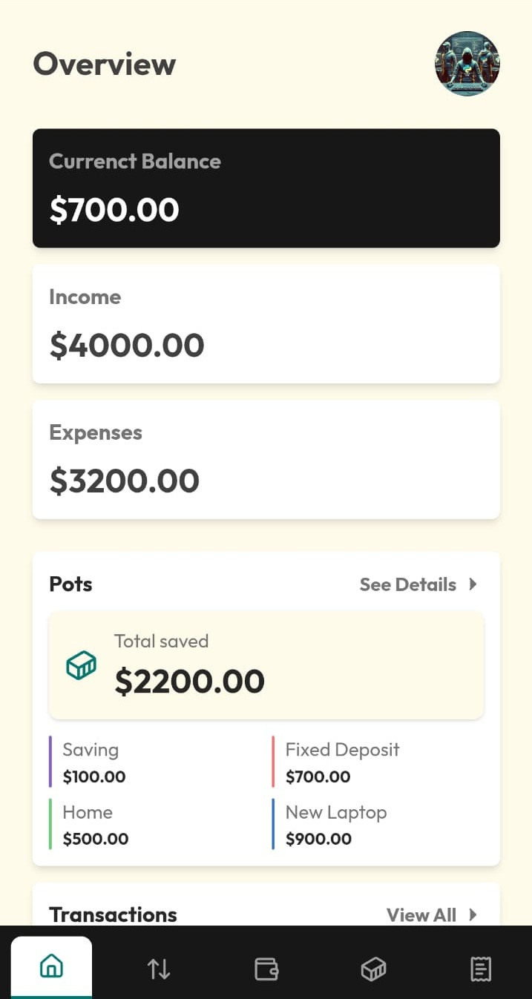

# 💸 Finova

Finova is a full-stack MERN Expense Tracker application that helps users manage personal finances efficiently with features like transaction tracking, budgeting, savings pots, recurring bills, and financial insights through a clean modern dashboard.

---

## 📌 Overview

Finova allows users to:
- Track income and expenses
- Manage monthly budgets
- Create savings pots/goals
- Monitor recurring bills
- View financial summaries and analytics
- Securely manage their account with authentication

This project focuses on simplifying personal finance management with a modern UI and organized financial tracking system.

---

## 🛠️ Tech Stack

**Frontend:**
- React.js  
- Tailwind CSS  

**Backend:**
- Node.js  
- Express.js  

**Database:**
- MongoDB  

**Authentication:**
- JSON Web Token (JWT)  
- bcrypt  

**Other Tools & Services:**
- Cloudinary (for profile image upload)  
- Axios  
- React Hot Toast  
- Recharts (for analytics charts)  
- Vercel (Frontend Deployment)  
- Render (Backend Deployment)  

---

## ✨ Features

- 🔐 User Authentication (Signup/Login)
- 💰 Track Income & Expenses
- 📊 Financial Overview Dashboard
- 🧾 Recurring Bills Management
- 🎯 Budget Creation & Monitoring
- 🏦 Savings Pots / Goal Tracking
- 📈 Expense Analytics with Charts
- 🖼️ Profile Management with Avatar Upload
- ⚡ Clean & Responsive Modern UI

---

## 📸 Screenshots










---

## 🌐 Live Demo

Frontend: _Coming Soon_  
Backend API: _Coming Soon_

---

## ⚙️ Installation & Setup

```bash
# Clone the repository
git clone https://github.com/your-username/finova.git

# Navigate to project folder
cd Finova

# Install frontend dependencies
cd client
npm install

# Install backend dependencies
cd ../server
npm install

# Run frontend
cd ../client
npm run dev

# Run backend
cd ../server
npm run server
```

---

## 🔐 Environment Variables

Create a `.env` file in the server folder and add:

```env
PORT=
CLIENT_URL=
MONGODB_URL=
JWT_SECRET=
CLOUD_NAME=
CLOUD_API_KEY=
CLOUD_API_SECRET=
```

---

## 🧠 Learnings

- Built a complete MERN finance management application  
- Implemented secure authentication using JWT & bcrypt  
- Managed complex financial state and CRUD operations  
- Designed reusable and responsive UI components  
- Integrated charts and analytics visualization  
- Worked with REST APIs and MongoDB relationships  

---

## 🚧 Future Improvements

- 📱 Improve mobile responsiveness  
- 🔔 Add bill payment reminders & notifications  
- 📅 Monthly financial reports & exports  
- 🌍 Multi-currency support  
- 📊 More advanced analytics & insights  
- 👥 Shared budgets and family finance tracking  

---

## 👨‍💻 Author

**Mohd Hamza**  
GitHub: https://github.com/hamzamohd092007  

---

## ⭐ Show Your Support

If you like this project, give it a ⭐ on GitHub!